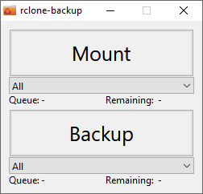

# rclone-backup

Graphical user interface to [rclone](https://rclone.org/) for backups to cloud-storages like Amazon, Dropbox, Google, FTP, SCP, ... with support for end-to-end-encryption.



## Configuration
Configuration has to be made in rclone-backup.ini accordingly to the rclone-API-documentation and is divided into 3 sections
- config/create: https://rclone.org/rc/#config-create
- mount: https://rclone.org/rc/#mount-mount
- sync: https://rclone.org/rc/#sync-sync

For each section multiple entries can be specified.

Example cloud-storage at SCP-server:
```
[config/create]
name=Cloud type=sftp  parameters={ "host":"scp.example.com", "user":"username", "pass":"password", "disable_hashcheck":true }

[mount]
fs=Cloud: mountPoint=X: vfsOpt={ "CacheMode":"writes", "CacheMaxSize":"1000M" } mountOpt={ "VolumeName":"Cloud" }          _config={ "ModifyWindow":1000000000 }

[sync]
srcFs=D:\data\photos dstFs=Cloud:photos    createEmptySrcDirs=true _config={ "ModifyWindow":1000000000 }
srcFs=E:\documents   dstFs=Cloud:documents createEmptySrcDirs=true _config={ "ModifyWindow":1000000000 }
```

Example cloud-storage at SCP-server with end-to-end-encryption:
```
[config/create]
name=CloudRemote type=sftp  parameters={ "host":"scp.example.com", "user":"username", "pass":"password", "disable_hashcheck":true }
name=Cloud       type=crypt parameters={ "remote":"CloudRemote:/path1/path2", "password":"encryption-password" }

[mount]
fs=Cloud:                   mountPoint=X: vfsOpt={ "CacheMode":"writes", "CacheMaxSize":"1000M" } mountOpt={ "VolumeName":"Cloud" }          _config={ "ModifyWindow":1000000000 }
fs=CloudRemote:/path1/path2 mountPoint=Y: vfsOpt={ "CacheMode":"writes", "CacheMaxSize":"1000M" } mountOpt={ "VolumeName":"CloudEncrypted" } _config={ "ModifyWindow":1000000000 }

[sync]
srcFs=D:\data\photos dstFs=Cloud:photos    createEmptySrcDirs=true _config={ "ModifyWindow":1000000000 }
srcFs=E:\documents   dstFs=Cloud:documents createEmptySrcDirs=true _config={ "ModifyWindow":1000000000 }
```

To store the password obscured in the configuration-file rclone can be used to obscure the password: \
`rclone obscure password`

## Known errors
"Queue" may still show entries at mount, although transfer is completed.

## Download
Windows: [rclone-backup.zip](https://github.com/alexgit2k/rclone-backup/releases/latest/download/rclone-backup.zip)

## Third Party Inclusions
Icon from Frank Souza: https://iconarchive.com/show/fs-icons-by-franksouza183/Places-folder-backup-icon.html

## License and Copyright
This software is copyright (c) 2022 by alexgit2k.

This is free software, licensed under MIT License.
